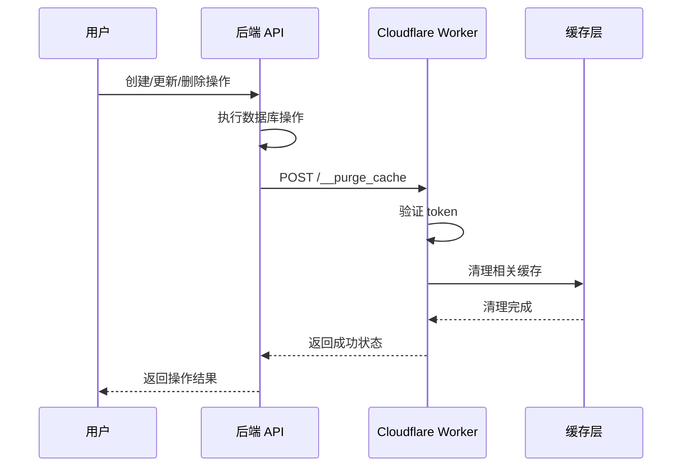

# 自动缓存清理功能使用指南

## 概述

本功能实现了在数据更新操作（创建、修改、删除考试和题目）后自动清理 Cloudflare Workers 缓存，确保用户始终获取到最新的数据。

## 功能特性

### 🚀 自动触发
- **考试操作**：创建、更新、删除、发布考试时自动清理相关缓存
- **题目操作**：创建、更新、删除题目时自动清理相关缓存
- **智能清理**：只清理受影响的缓存路径，避免过度清理

### 🎯 精准清理
- **考试缓存**：`/api/marketplace/exams`、`/api/student/exams`、`/api/teacher/dashboard`
- **题目缓存**：`/api/teacher/questions`、`/api/teacher/dashboard`
- **市场缓存**：`/api/marketplace/categories`、考试详情页面

### 🔒 安全验证
- 使用 Bearer Token 验证缓存清理请求
- 防止未授权的缓存操作
- 支持自定义授权 token

## 配置步骤

### 1. Cloudflare Worker 配置

在 `wrangler.toml` 中添加缓存清理 token：

```toml
[vars]
ORIGIN_SERVER = "https://your-backend-server.com"
CACHE_PURGE_TOKEN = "your-secure-cache-purge-token"
```

### 2. 后端环境变量配置

在 `.env.local` 文件中添加：

```bash
# Cloudflare Worker 缓存配置
CLOUDFLARE_WORKER_URL=https://your-worker.your-subdomain.workers.dev
CACHE_PURGE_TOKEN=your-secure-cache-purge-token
```

**重要提示：**
- `CACHE_PURGE_TOKEN` 必须在 Worker 和后端保持一致
- 建议使用强密码作为 token
- 如果不配置这些变量，缓存清理功能将被跳过

### 3. 验证配置

检查以下文件是否正确配置：

- ✅ `cloudflare-worker.js` - 包含 `handleCachePurge` 函数
- ✅ `lib/cache-invalidation.ts` - 缓存清理工具函数
- ✅ API 路由文件 - 已添加缓存清理调用

## 工作流程



## 支持的操作

### 考试相关

| 操作 | API 路径 | 清理的缓存路径 |
|------|----------|----------------|
| 创建考试 | `POST /api/teacher/exams` | 市场页面、学生考试列表、教师仪表板 |
| 更新考试 | `PUT /api/teacher/exams/[id]` | 考试详情、市场页面、相关列表 |
| 删除考试 | `DELETE /api/teacher/exams/[id]` | 所有相关缓存 |
| 发布考试 | `PUT /api/teacher/exams/[id]/publish` | 市场页面、考试状态 |

### 题目相关

| 操作 | API 路径 | 清理的缓存路径 |
|------|----------|----------------|
| 创建题目 | `POST /api/teacher/questions` | 题目列表、教师仪表板 |
| 更新题目 | `PUT /api/teacher/questions/[id]` | 题目详情、列表缓存 |
| 删除题目 | `DELETE /api/teacher/questions/[id]` | 相关题目缓存 |

## 监控和调试

### 1. 检查缓存清理状态

在浏览器开发者工具中查看网络请求：

```bash
# 成功的缓存清理请求
POST /__purge_cache
Status: 200 OK
Response: {"success": true, "message": "Successfully purged cache for 3 paths"}
```

### 2. 常见问题排查

**缓存清理失败：**
```bash
# 检查 Worker 日志
wrangler tail your-worker-name

# 检查后端日志
缓存清理请求失败: 401 Unauthorized
```

**Token 不匹配：**
```bash
# 确保 token 一致
echo $CACHE_PURGE_TOKEN  # 后端
wrangler secret list     # Worker
```

### 3. 测试缓存清理

```bash
# 手动测试缓存清理 API
curl -X POST https://your-worker.workers.dev/__purge_cache \
  -H "Authorization: Bearer your-token" \
  -H "Content-Type: application/json" \
  -d '{"paths": ["/api/marketplace/exams"]}'
```

## 性能影响

### ✅ 优势
- **数据一致性**：确保用户获取最新数据
- **自动化**：无需手动清理缓存
- **精准清理**：只清理必要的缓存路径
- **异步执行**：不影响 API 响应时间

### ⚠️ 注意事项
- 缓存清理是异步操作，不会阻塞 API 响应
- 清理失败不会影响正常业务功能
- 建议在生产环境中监控缓存清理成功率

## 故障排除

### 问题：缓存清理不生效

**可能原因：**
1. 环境变量未正确配置
2. Token 不匹配
3. Worker URL 错误
4. 网络连接问题

**解决方案：**
1. 检查 `.env.local` 和 `wrangler.toml` 配置
2. 确保 `CACHE_PURGE_TOKEN` 在两端一致
3. 验证 `CLOUDFLARE_WORKER_URL` 格式正确
4. 检查网络连接和防火墙设置

### 问题：缓存清理请求超时

**解决方案：**
1. 增加请求超时时间
2. 检查 Worker 性能和响应时间
3. 考虑使用队列系统处理大量清理请求

## 最佳实践

1. **安全性**：使用强密码作为 `CACHE_PURGE_TOKEN`
2. **监控**：定期检查缓存清理成功率
3. **测试**：在开发环境中充分测试缓存清理功能
4. **备份**：保留手动缓存清理的能力作为备选方案
5. **文档**：记录自定义的缓存清理规则和路径

## 扩展功能

### 自定义缓存清理规则

可以根据业务需求扩展 `lib/cache-invalidation.ts`：

```typescript
// 添加新的缓存清理函数
export async function invalidateCustomCache(customPaths: string[]) {
  await invalidateCloudflareCache(customPaths)
}
```

### 批量缓存清理

```typescript
// 批量清理多个资源的缓存
export async function invalidateBatchCache(operations: Array<{type: string, id: string}>) {
  const paths = operations.flatMap(op => generateCachePathsForOperation(op))
  await invalidateCloudflareCache(paths)
}
```

通过这个自动缓存清理功能，考试系统能够在保持高性能缓存的同时，确保数据的实时性和一致性。